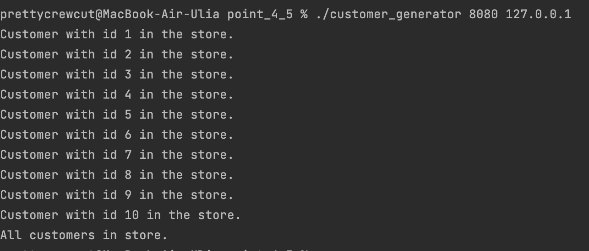
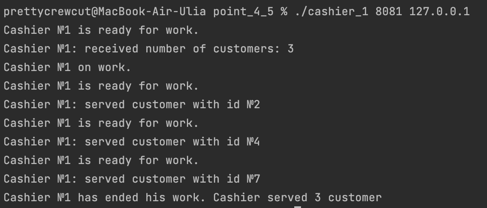
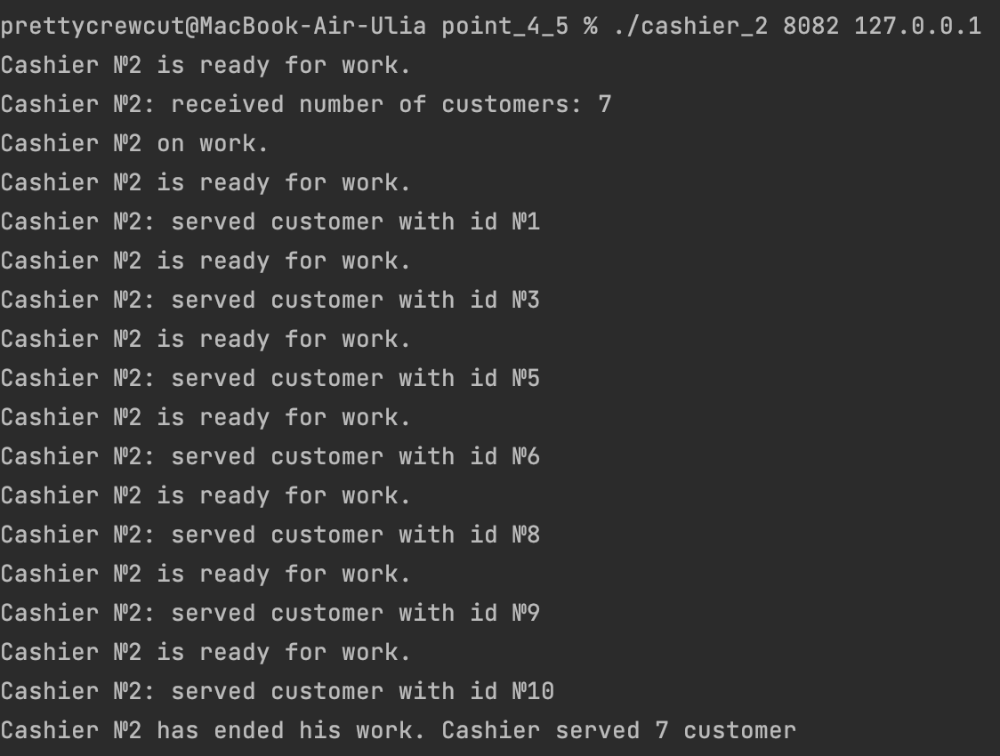
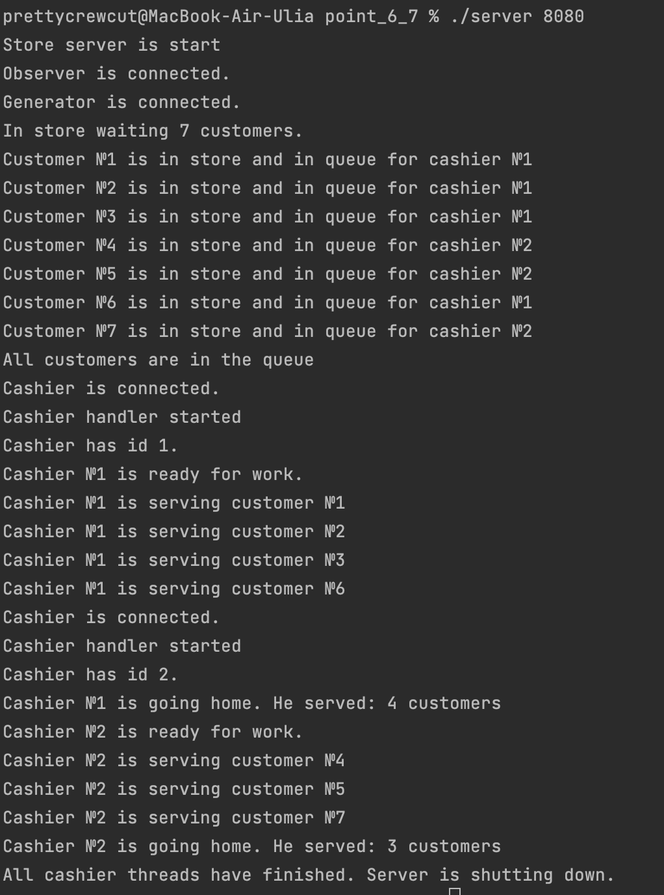
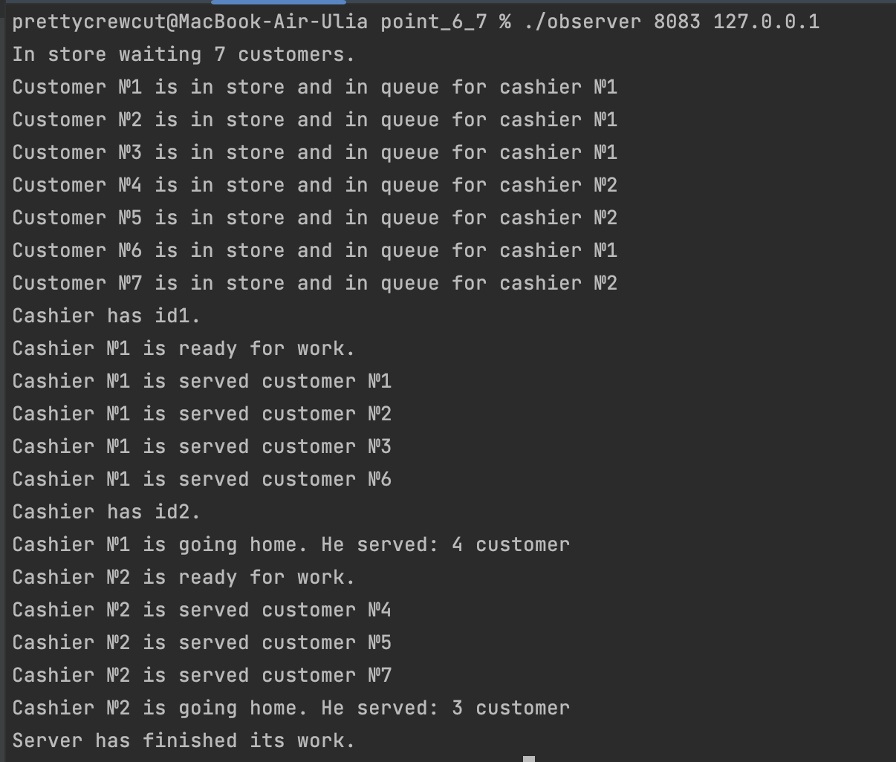
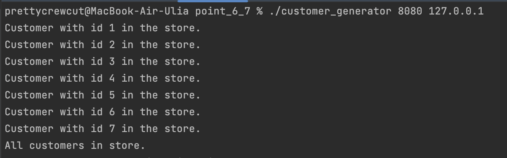
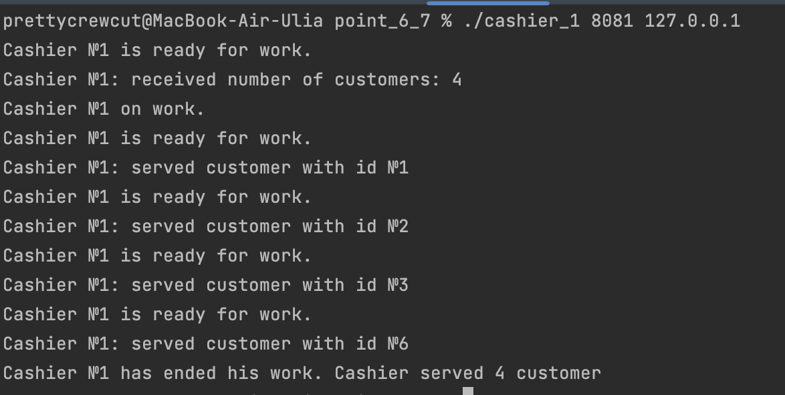
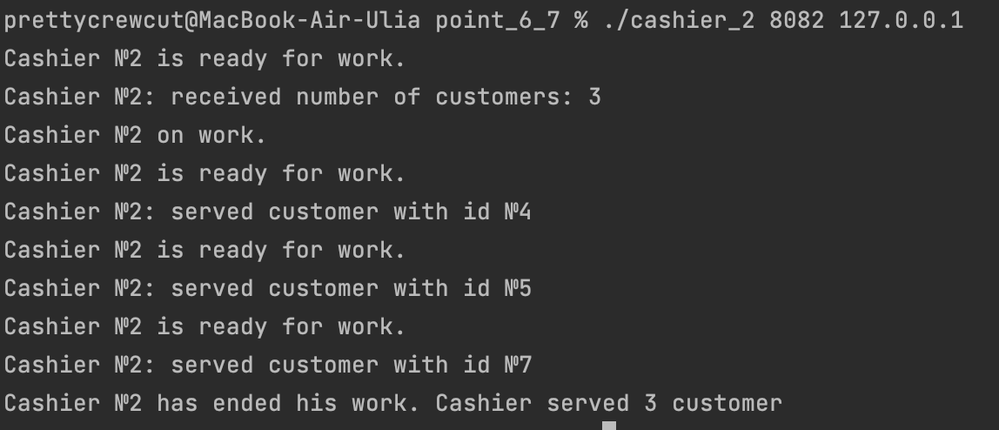

# ИДЗ №4 по ОС
## Удачной проверки)
## Выполнила: Гудошникова Юлия Владимировна
## Группа: БПИ217
## Вариант 9
Задача о супермаркете. В супермаркете работают два кассира, покупатели заходят в супермаркет, делают покупки и становятся в очередь к случайному кассиру. Пока очередь пуста, кассир «спит», как только появляется покупатель, кассир «просыпается». Покупатель «спит» в очереди, пока не подойдет к кассиру. Создать приложение, моделирующее рабочий день супермаркета. Каждого кассира и каждого покупателя реализовать в виде отдельных процессов

### Файлы
В файлах с расширением .c хранится исходный код

## Работа сделана на 7 баллов
Программы на каждый из баллов представлены в соответствующей папке task_№, где вместо № цифра от 4-7
## Запуск
Для запуска:
После запуска сервера первым необходимо подключить генератор покупателей, если попытаться подключить другой клиент, то сервер просто закроет соединение с ним. Мне показалось логичным, что сначала покупатели должны зайти в магазин, а потом уже кассиры начнут работать.
Затем подключаются кассиры в любом порядке.
При запуске сервера указывается порт(например 8080), а для запуска клиентов порт и ip(например 8080 127.0.0.1), причем для каждого последующего клиента номер порта увеличивается на 1.
Пример:
порт при запуске сервера - 8080
порт при запуске клиента-генератора -8080
порт при запуске клиента-кассира 1 - 8081
порт при запуске клиента-кассира 2 - 8082
порт при запуске клиента-наблюдателя - 8083
В папках на соответствующие баллы находятся уже скомпилированные файлы для запуска, осталось только запустить))

## Сценарий
### Работа сервера: 
1) Сервер запускается и ожидает входящих подключений на заданном порту.
2) Подключается генератор покупателей, который передает количество покупателей и информацию о каждом покупателе. (если подключается не генератор, то его соединение сбрасывается и сервер ждет новое)
3) Сервер принимает информацию о покупателях и распределяет их между двумя кассирами. Покупатели разделены на две группы в зависимости от своего типа: первый тип кассиру 1, второй тип кассиру 2.
4) Генератор покупателей завершает подключение, и сервер готов к работе с кассирами.
5) Сервер принимает подключения от двух кассиров и создает отдельный поток для каждого из них.
6) Каждый кассир получает свой идентификатор и информацию о количестве покупателей, которых он должен обслужить.
7) Кассиры поочередно проверяют готовность каждого покупателя в своей очереди и обслуживают только тех покупателей, которые соответствуют их типу и готовы к обслуживанию.
8) Кассир отправляет идентификатор обслуженного покупателя клиенту и увеличивает счетчик обслуженных покупателей.
9) Когда каждый кассир обслуживает все покупатели из своей очереди, он завершает свою работу и закрывает соединение с клиентом.
10) Сервер ожидает завершения работы всех кассиров и после этого завершает свою работу.
### Работа кассира
1) Кассир создает UDP сокет и подключается к серверу с помощью IP-адреса и порта, полученных из аргументов командной строки.
2) Кассир отправляет свой идентификатор и идентификатор кассира серверу.
3) Кассир получает количество покупателей, которых ему необходимо обслужить, от сервера.
4) Кассир начинает обработку каждого покупателя. 
5)Он отправляет информацию о готовности серверу и получает ответ с идентификатором покупателя, которого он обслужил. Кассир выводит информацию о покупателе, которого он обслужил.
6) Когда кассир обслуживает всех покупателей, он получает количество обслуженных покупателей серверу и завершает работу.
### Работа генератор-покупателей
1) Клиент-покупатель создает UDP сокет и подключается к серверу с помощью IP-адреса и порта, полученных из аргументов командной строки.
2) Клиент-покупатель отправляет свой идентификатор и количество покупателей, которых он сгенерирует, серверу.
3) Клиент-покупатель генерирует случайное количество покупателей (от 1 до 20) и отправляет их идентификаторы серверу.
4) Клиент-покупатель выводит информацию о каждом покупателе, который находится в магазине.
5) После того, как все покупатели находятся в магазине, клиент-покупатель завершает свою работу и отключается от сервера.
## Отчет на 4-5 балла
### Выполненные критерии
Разработано клиент–серверное приложение, в котором сервер  и клиенты независимо друг от друга отображают только ту информацию, которая поступает им во время обмена.
При запуске программ требуемые для их работы IP адреса и порты необходимо задавать в командной строке, чтобы обеспечить гибкую подстройку к любой сети. (порты и IP адреса здаются через командную строку, для сервера - только порт)
Код использует сокеты для обмена данными между сервером и клиентом, что является одним из ранее изученных программных объектов
Код позволяет запускать сервер и клиентов на одном компьютере или на нескольких компьютерах в сети.

### Результаты работы

## Отчет на 6-7 баллов
### Запуск
В данном случае необходимо сначала подключить наблюдателя, а потом все остальное в порядке соответствующем прошлому критерию.
### Схема работы наблюдателя
основная схема работы клиента. Он устанавливает соединение с сервером, отправляет идентификатор и затем принимает и выводит сообщения от него, а затем закрывает соединение.

### Изменения, внесенные в серверный код:
Добавлена глобальная переменная observer_socket, которая представляет сокетный дескриптор для клиента-наблюдателя.
Добавлена функция sendToObserver, которая отправляет сообщения на клиент-наблюдатель.
Добавлена функция observerHandler, которая обрабатывает подключение клиента-наблюдателя в отдельном потоке.
Добавлена проверка на сигналы SIGINT и SIGTERM в функции sigfunc.
В функции cashierHandler добавлена отправка сообщений на клиент-наблюдатель для отслеживания состояния работы кассира и обслуживаемых им клиентов.
В функции readCustomers добавлена отправка сообщений на клиент-наблюдатель для отслеживания состояния очереди покупателей в магазине.
Добавлены вызовы функции sendToObserver и соответствующие выводы на консоль для информирования о состоянии системы и событиях.
Общий эффект внесенных изменений заключается в том, что сервер теперь может отправлять информацию на клиент-наблюдатель, чтобы отображать состояние системы в реальном времени. Это позволяет независимо отображать информацию сервера и клиентов без какого-либо общего вывода интегрированной информации.

### Результаты тестов

